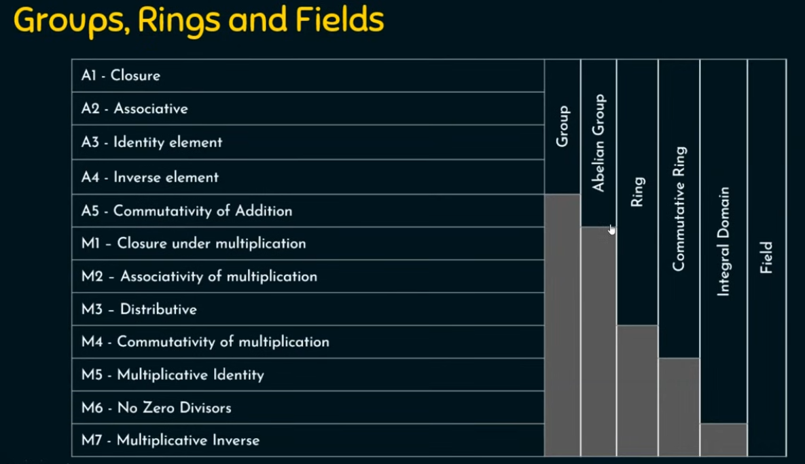

This image illustrates the fundamental concepts of Groups, Rings, and Fields, which are essential algebraic structures in the field of mathematics. Understanding these structures is crucial for various applications in cryptography, coding theory, and more.
